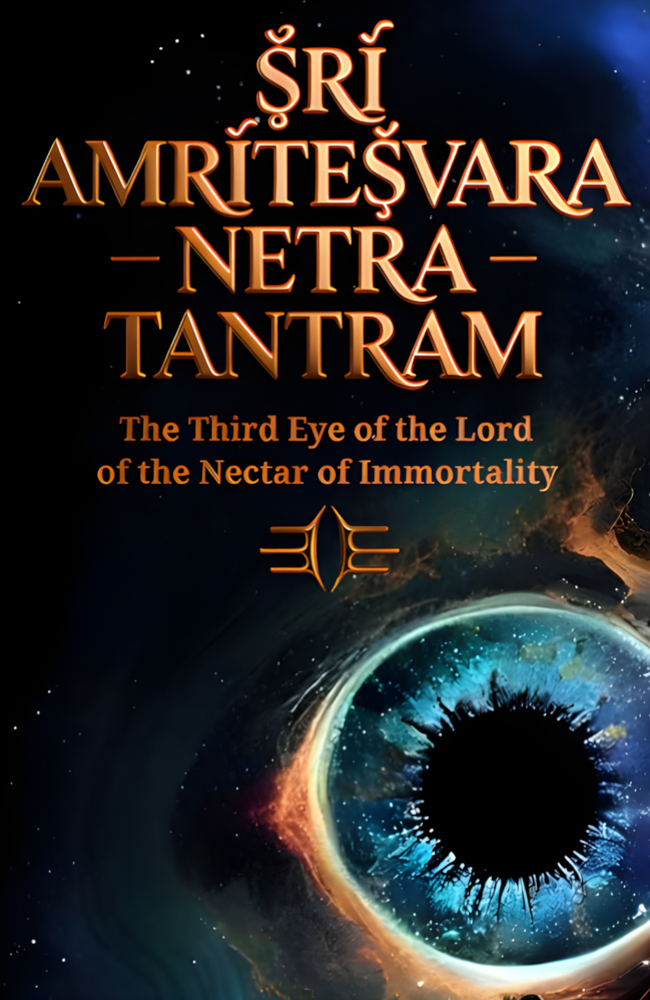

# Netra Tantra
## AI Translation

When one recognizes that the seeker, the sought, and the search are one and the same—that there is nothing to attain, that the ground of pure, total consciousness has always been present beneath the obscurations of thought, sensation, and feeling—then, spontaneously, a moment arises in which the taste, the spiritual savor of the realization “I am This,” becomes all-pervasive. That experience—that luminous presence, that blossoming fragrance of immortality in its utter fullness—is the divine feminine Amṛteśvarī revealing herself as your very own heart-essence. She is not a form but an overflowing plenitude and self-aware silence that drips with refreshing, self-liberating sweetness.

Amṛteśvara is the Lord of the Third Eye, the sovereign witness of the all-pervading Self. His gaze is not directed outward toward a world but inward-awake; he perceives no object as external, no subject as the perceiver. Deep within his heart he knows himself to be the very ground from which seer, seeing, and seen arise in all apparent beings. He witnesses—that is, he witnesses Himself—immediately, totally, without constructs, labels, or conditions, as an undivided field of self-shining, pure, and total conscious awareness. He is reality as it is, and he embraces Amṛteśvarī as she drips. The Netra is that which allows him to notice her rain.

